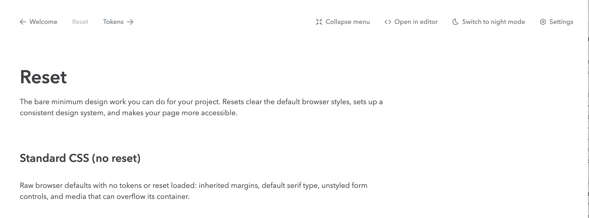

# nice-storybook-navigation

A Storybook addon for the Nice design system: a fixed **preview-side navigation
bar** with

- back / next story navigation across consumer-defined sequences,
- a sidebar (nav) toggle, a dark-mode toggle, and an open-in-editor action,
- a settings menu mirroring Storybook's gear menu.

The bar renders in the preview iframe; a small manager entry bridges its actions
to the Storybook `api` over the addons channel. (The manager **sidebar tree**
styling is a separate addon, `nice-storybook-theme`.)

## Screens

At desktop width every control carries its label, and the current page sits
between the back / next links.



Below tablet the bar sheds what does not fit. The sidebar toggle and
open-in-editor drop away — the sidebar lives behind Storybook's mobile menu
there, and there is no editor to open — and so does the centre label. The back /
next links keep their arrows without labels, the remaining controls become square
and size their glyphs from the icon scale, and a menu control opens Storybook's
own mobile menu.


## Install

```bash
npm install -D nice-storybook-navigation
```

Requires (peers): `storybook` ≥ 10, `storybook-dark-mode`, `@storybook/addon-links`,
`react`, `react-dom`, `styled-components`, and the Nice packages it renders with.

## Wire it up

`.storybook/main.ts`:

```ts
const config = {
  addons: [
    "@storybook/addon-links",
    "storybook-dark-mode",
    "nice-storybook-navigation", // loads its manager + preview entries
  ],
}
export default config
```

Supply your own navigable sequences (their ids are your story ids) via the
`storyNavigation` parameter in `.storybook/preview.ts(x)`:

```ts
export const parameters = {
  storyNavigation: {
    sequences: [
      [
        { id: "basics-welcome--docs", label: "Welcome" },
        { id: "basics-tokens--docs", label: "Tokens" },
      ],
    ],
  },
}
```

## License

MIT
